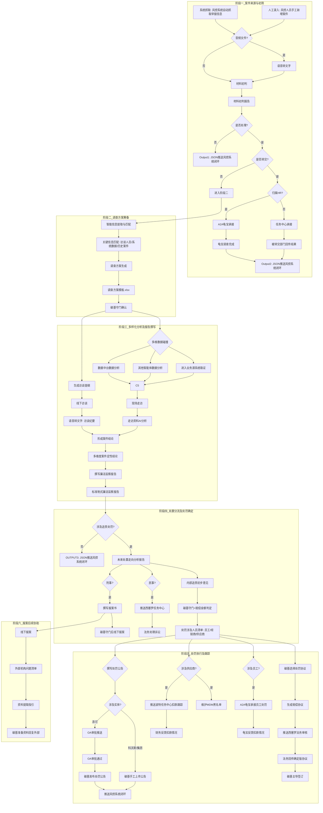

# 赫尔墨斯智能体 — 廉洁监察模块需求文档 v2.1

---

## 目录

1. [项目背景与业务痛点](#1-项目背景与业务痛点)
2. [建设目标](#2-建设目标)
3. [智能体权限说明](#3-智能体权限说明)
4. [输出物形式概述](#4-输出物形式概述)
5. [核心功能模块](#5-核心功能模块)
   - [5.1 阶段一：案件来源与初筛](#51-阶段一案件来源与初筛-intake--initial-screening)
   - [5.2 阶段二：智能调查方案筹备](#52-阶段二智能调查方案筹备-investigation-planning)
   - [5.3 阶段三：多样化分析及案件报告撰写](#53-阶段三多样化分析及案件报告撰写-diverse-analysis--case-report-finalization)
   - [5.4 阶段四：处置分流及处罚确定](#54-阶段四处置分流及处罚确定-decision--penalty-determination)
   - [5.5 阶段五：处罚执行及跟踪](#55-阶段五处罚执行及跟踪-penalty-enforcement--tracking)
   - [5.6 阶段六：报案后续协助](#56-阶段六报案后续协助-subsequent-assistance)
6. [任务ID生成规则](#6-任务id生成规则)
7. [智能体与风控系统交互说明](#7-智能体与风控系统交互说明)
8. [外部智能体协作](#8-外部智能体协作)
9. [字段映射关系总表](#9-字段映射关系总表)
10. [全流程总览](#10-全流程总览)

---

## 1. 项目背景与业务痛点

目前公司在廉洁监察与反舞弊工作中，人工（碳基）处理方式面临诸多瓶颈，亟需引入 AI 智能体进行赋能：

| 痛点 | 详细描述 |
|------|----------|
| **线索发现被动** | 廉洁监测的案件来源长期单一依赖于举报线索。业务系统日常运行中产生海量数据，其中隐藏的异常操作痕迹，人工缺乏时间和精力去主动识别。 |
| **调查决策依赖经验** | 收到舞弊信息后，对于案件的定性与走向（走刑事、民事还是内部追查赔款）缺乏标准化指引。判断相关案件构成要件是否满足、借鉴过往成功判例时，目前高度依赖人工多方询问，效率低下。 |
| **取证与存证困难** | 在识别有效举报信息、抓取海量证据以及对核心证据进行存证留档等方面，人工处理效率低，需要 AI 的支持。 |
| **追责闭环断裂** | 后期内部追责环节费时费力，难以保证追责环节的连贯性以及最终处罚的落实到位。 |

---

## 2. 建设目标

| 建设目标 | 说明 |
|----------|------|
| **拓宽案件来源** | 解决案件来源扩源的问题，从"被动等线索"转变为"主动找异常"。 |
| **提供智能调查引导** | 智能体需能在案件的调查方向上给出引导，提升决策效率与准确性。 |
| **实现高效固证** | 提升海量证据抓取与核心证据存证留档的效能。 |
| **保障处罚落地** | 解决追责环节的连贯性及处罚到位的问题，形成风控闭环。 |

---

## 3. 智能体权限说明

### 3.1 权限角色划分

针对该模块的权限管理，暂定划分为三种角色：

| 角色 | 权限范围 |
|------|----------|
| **集团** | 可查看所有举报案件。 |
| **科沃斯** | 仅可查看涉及公司为科沃斯的案件。 |
| **添可** | 仅可查看涉及公司为添可的案件。 |

### 3.2 权限控制规则

1. **筛选界面权限**：在所有涉及筛选的界面中，依据登录用户的角色不同，仅能看到对应角色能看到的案件。
2. **案件添加权限**：在手动添加案件信息的界面中，各角色只能添加各角色所属的公司对应的舞弊案件线索。
3. **任务中心权限**：后续任务中心界面也遵从上述的权限管理，各角色仅能看到各角色权限范围内的舞弊案件的相关任务。

---

## 4. 输出物形式概述

所有的输出物均支持以下两种功能：

| 功能 | 说明 |
|------|------|
| **方案变更** | 支持对智能体生成的输出物方案进行变更调整。 |
| **划词调整** | 支持通过选中文本（划词）方式进行局部内容调整。 |

所有输出物导出时的格式需限定在以下常用格式：

- Word 格式（.docx）
- Excel 格式（.xlsx）
- 其他常用文档格式

---

## 5. 核心功能模块

### 5.1 阶段一：案件来源与初筛（Intake & Initial Screening）

#### 5.1.1 功能概述

**双轨案件来源**：系统支持两种案件信息录入方式。

| 来源类型 | 说明 |
|----------|------|
| **a. 系统抓取** | 智能体可从风控系统自动抓取举报案件信息。 |
| **b. 人工录入** | 风控人员也可手工在模块里新增案件信息。 |

**多模态预处理**：针对语音类线索，智能体需具备语音转文字功能。

**分流决策**：经过材料初判与初筛，智能体需出具材料初判报告，明确是否开展调查的结论及对应的理由以及该事件的处置方式（内部、刑事、民事）。

**分流处理**：智能体初判后对此事件进行分流判断，包含以下三个节点：

| 分流节点 | 说明 |
|----------|------|
| **是否处置** | 判断案件是否需要进一步处理。若不处理，则智能体自动将相关数据推送到风控系统完成闭环。 |
| **是否转交** | 若处理，判断是否需要转交其他部门。若事件可由 HR 处理，则智能体 A2A 到龟宝承接后续案件调查，调查完毕后回传数据给到赫尔墨斯推送风控系统闭环，关闭举报事件。若事件由其他部门处理，则由被转交部门智能体任务中心承接，最终被转交部门通过任务中心回传处理结果给到赫尔墨斯，由赫尔墨斯完成后续系统闭环，关闭举报案件。 |
| **是否归属 HR** | 若转交，判断是否归属 HR 处理。 |

**碳基守门**：碳基（人工）对初判结果和分流判断进行守门确认。

#### 5.1.2 知识库内容

| 知识库内容 | 说明 |
|------------|------|
| 公司组织架构 | 用于识别案件涉及的组织层级与汇报关系。 |
| 公司人员名单 | 用于匹配案件涉及的员工信息。 |
| 公司员工岗位职责 | 用于判断员工职责范围与异常行为。 |
| 公司客户清单 | 用于匹配案件涉及的客户信息。 |
| 公司供应商清单 | 用于匹配案件涉及的供应商信息。 |
| 内部管理制度 | 用于判断行为是否违反内部制度。 |
| 外部法律法规 | 用于判断行为是否违反外部法律法规。 |

**飞书知识库链接**：https://ecovacs.feishu.cn/drive/folder/OsY2fBpvuleAiidmI4rcvV4Dn7e

#### 5.1.3 输入输出物

| 环节 | 输入（IN） | 输出（OUT） |
|------|-----------|------------|
| **Input1：从风控系统-舞弊处理模块获取基本信息** | 风控系统-舞弊处理模块带来的基本信息，包含：舞弊来源、舞弊编号、事业部、举报时间、舞弊事件名称、舞弊人员、舞弊供应商、舞弊经销商、舞弊事件详情、相关证据、附件、举报人电话、举报人邮箱、举报人其他信息、创建日期、分发人员、分发意见、计划结案日期等所有字段（详见第7节字段映射表）。 | — |
| **Input2：各智能体日常巡检风险事件推送** | 未来各智能体在日常工作中发现的风险事件主动推送至廉洁检查模块的数据。 | — |
| **语音转文字功能（IN/OUT）** | 上一环节的 Input1 或 Input2 中涉及的音频文件。 | 音频文件转文字的 Word 文档。 |
| **材料初判（IN/OUT）** | 上述 Input1 & Input2 抓取的所有字段 + 附件文档的解析 + 语音转文字文档。 | 材料初判报告 + 调查对象类型的值（员工、供应商、经销商）。 |
| **模板** | — | 材料初判模板.xlsx |
| **是否处理（IN/OUT）** | 材料初判文件中 AI 针对是否处理的结论。 | 值：是 or 否，最终体现在原型中变成一个选项让碳基守门。 |
| **Output1（IN/OUT）** | 是否处理环节 OUT = 否。 | 一份可以和风控系统交互的 JSON 文件，可以在人工守门完成后自动同步到风控系统中，将后续的字段完成填写。具体交互参见第7节。 |
| **是否转交（IN/OUT）** | 是否处理环节 OUT = 是，材料初判文件中 AI 针对是否转交的结论。 | 值：是 or 否，最终体现在原型中变成一个选项让碳基守门。 |
| **是否归属 HR 处理（IN/OUT）** | 是否处理环节 OUT = 是，是否转交环节 OUT = 是，材料初判文件中 AI 针对是否归属 HR 处理的结论。 | 值：是 or 否，最终体现在原型中变成一个选项让碳基守门。守门完成后至 A2A 或辛顿平台任务中心交互。 |
| **Output2（IN/OUT）** | A2A 或辛顿平台任务中心交互的文件。 | 一份可以和风控系统交互的 JSON 文件，可以在人工守门完成后自动同步到风控系统中，将后续的字段完成填写。具体交互参见第7节。 |

#### 5.1.4 原型界面筛选条件

线索初判界面的筛选条件需包含：

| 筛选条件 | 说明 |
|----------|------|
| 公司 | 按公司实体筛选。 |
| 线索来源 | 按案件来源渠道筛选。 |
| 任务ID | 按唯一任务编号筛选。 |
| 状态 | 按处理状态筛选。 |

同时需配置以下功能按钮：

| 按钮 | 说明 |
|------|------|
| 手动添加任务 | 用于风控人员手工新增案件信息。 |
| 查询 | 用于按筛选条件查询案件。 |

---

### 5.2 阶段二：智能调查方案筹备（Investigation Planning）

#### 5.2.1 功能概述

对于需由风控部门立案调查的线索，经碳基守门确定事件需要处理后，智能体将自动执行以下前置准备：

| 功能 | 说明 |
|------|------|
| **智能信息提取与匹配** | 智能体自动提取材料初判中的关键字段，并进行关键信息匹配，提示后续碳基可能需要找哪些人开展访谈或了解案件真实情况、可能需要去哪些系统抓取什么样的数据、过往案件相关案件的调查方式。 |
| **调查方案生成** | 基于知识库，智能体会自动生成案件的初步走向预判及调查方案。 |

#### 5.2.2 知识库内容

| 知识库内容 | 说明 |
|------------|------|
| 外部类似案件相关法条 | 用于参考外部类似案件的法律适用。 |
| 公司的各业务系统 | 用于了解哪些系统可提供所需数据。 |
| 公司智能体及对应功能、数据 | 用于了解各智能体可提供的分析能力。 |
| 过往的舞弊案件及对应处理方案等 | 用于参考历史案件的处理方式。 |

**飞书知识库链接**：https://ecovacs.feishu.cn/drive/folder/EWlGfnNPxlYJ2hdPeMDchW4inPh

#### 5.2.3 输入输出物

| 环节 | 输入（IN） | 输出（OUT） |
|------|-----------|------------|
| 形成案件初步走向及调查方案 | Input1 or Input2 及相关附件、语音转文字文件、材料初判报告。 | 调查方案模板.xlsx |

---

### 5.3 阶段三：多样化分析及案件报告撰写（Diverse Analysis & Case Report Finalization）

#### 5.3.1 功能概述

在此阶段，AI 将作为风控人员（纯碳基）的超级助理协助完成数据分析和访谈验证：

| 功能 | 说明 |
|------|------|
| **多维数据碰撞** | 根据调查方案，智能体将告知碳基需要通过获取哪些公司内的系统数据去验证舞弊案件的真实性。碳基可自行前往各系统获取数据，后在智能体内导入获取的数据，通过写入 SQL 语句完成对数据的初步筛选。最后交由智能体对数据进行比对与深度分析。 |
| **访谈提纲生成** | 智能体依据已生成的调查方案，自动输出拟访谈的人员及对应的初步的访谈提纲，供风控人员参考。 |
| **访谈记录沉淀** | 纯碳基任务（如线下访谈）完成后，利用语音转文字功能，提取关键信息，辅助人工形成最终的调查结论。 |
| **案件结论** | 完成所有线下工作后，碳基上传现场走访记录，智能体结合数据分析结果、现场走访记录、访谈记录三方面进行全面分析，出具初步的案件结论。 |
| **智能报告撰写** | 智能体基于前期的证据链和调查结论，配合知识库内的相关知识自动生成调查报告初稿，减轻人工撰写负担，最终由碳基守门。 |

#### 5.3.2 知识库内容

| 知识库内容 | 说明 |
|------------|------|
| 过往舞弊案件调查报告 | 用于参考历史案件的报告撰写风格与结论结构。 |
| 报告模板及对应格式具体要求 | 用于规范当前报告的格式与内容。 |

**飞书知识库链接**：https://ecovacs.feishu.cn/drive/folder/D179fFBoilVj4BdtKjvcWH77nxg?from=space_personal_filelist

#### 5.3.3 输入输出物

| 环节 | 输入（IN） | 输出（OUT） |
|------|-----------|------------|
| **调用数据中台数据进行分析** | 上一环节调查方案中 AI 判定需要通过数据中台调取的数据，此数据需从中间库调取到辛顿平台后，碳基可自主进行下载。 | 数据中台数据分析报告。无特定格式需求，要求全量数据分析，出具全面的分析报告，碳基守门后可自主下载。 |
| **其他智能体数据分析** | 上一环节调查方案中 AI 判定需要调取哪些智能体的分析报告，此数据需从各智能体调取到辛顿平台后，碳基可自主进行下载。 | 智能体数据分析报告。无特定格式需求，要求全量数据分析，出具全面的分析报告，碳基守门后可自主下载。 |
| **进入业务源系统取证** | 人工基于上一环节 AI 输出的调查方案中涉及的系统数据，需支持多文件上传功能。 | 原始数据的分析结果报告。无特定格式需求，要求全量数据分析，出具全面的分析报告，碳基守门后可自主下载。 |
| **生成访谈提纲** | 上一环节经碳基守门确认的调查方案中 AI 出具的拟访谈的对象。 | 所有访谈人员的访谈提纲，碳基守门后自主下载。 |
| **模板** | — | 访谈笔录-添可 |
| **现场走访** | 碳基现场走访的各类调查资料，包括但不限于以下输入物：人工撰写的走访任务调查发现，拍摄的照片、视频、录音、收集的文件等。 | AI 针对现场走访调查资料的分析报告，碳基守门后自主下载。 |
| **语音转文字（现场走访）** | 现场走访上传的文件中涉及到的音频文件以及开展访谈的录音文件。 | 语音转文字的记录文件以及访谈纪要。纪要文件和提纲大体模板类似，将提纲中的题目回答列示即可。 |
| **模板** | — | 访谈笔录模板 |
| **形成案件结论** | 中台数据分析报告 + 智能体分析数据报告 + 原始数据分析报告 + 现场走访环节的分析报告。 | 一份从多维度总结案件定性结论的报告，无需特定格式，通过提示词限定一些必有的字段，其他让 AI 发散性地去分析。必要字段限制如表内所示——案件结论。 |
| **撰写廉洁监察报告** | 上一环节的输出物——案件结论。 | 一份标准的制式模板出具的廉洁监察项目报告。以及上述的文件（中台数据原表、中台数据分析报告、智能体数据原表、智能体数据分析报告、人工上传数据原表、人工上传数据分析报告、访谈纪要、线下走访环节所有的输入物）作为附件可以进行下载。 |
| **模板** | — | 内审稽字(202X)0X号添可XXXXXXXX专项稽核报告 |

---

### 5.4 阶段四：处置分流及处罚确定（Decision & Penalty Determination）

#### 5.4.1 功能概述

**处置分流决策**：基于案件结论中的定性，进行以下分流：

| 条件 | 处理路径 |
|------|----------|
| **不涉及追责处罚** | 智能体将自动进行状态闭环，于辛顿平台及风控系统内关闭该举报事件。 |
| **涉及追责处罚** | 依据定性自主判断是否存在司法及纠纷路线，若存在则合并内部追责路线同步开展，若不存在则仅开展内部追责路线。 |

**三条并行走访路线**：

| 路线 | 说明 |
|------|------|
| **外部司法路线** | 若判定涉及刑事立案，流程将流转至撰写报案书，由碳基守门后移交对应同事进入后续司法移交程序。 |
| **民事纠纷路线** | 若判定涉及民事纠纷，流程将推送至西塞罗智能体的任务中心，由法务部门完成任务后线下与风控同步诉讼策略和诉讼结果。 |
| **内部处理路线** | 形成内部追责意见后，智能体结合知识库内的相关知识自动参照制度要求协助生成规范化的处置方案。 |

**内部追责意见定稿**：智能体出具规范化的追责意见后，风控人员将与各高级管理层确定最终的追责方案，并在守门完成后推进后续处罚执行及跟踪环节。

#### 5.4.2 知识库内容

| 知识库内容 | 说明 |
|------------|------|
| 过往舞弊案件调查报告 | 用于参考历史案件的追责处置方式。 |
| 报告模板及格式具体要求 | 用于规范处置方案文档格式。 |
| 公司制度文件 | 用于参照公司制度形成规范化处置方案。 |
| 追责审批流程 | 用于了解追责审批的路径与节点。 |
| 组织架构及分权 | 用于确定各层级管理职责与汇报关系。 |

**飞书知识库链接**：https://ecovacs.feishu.cn/drive/folder/GTHPff8FFlsMpgdEqcLcywAXnhh?from=space_personal_filelist

#### 5.4.3 输入输出物

| 环节 | 输入（IN） | 输出（OUT） |
|------|-----------|------------|
| **是否涉及追责处罚** | 案件结论的输出物，且其中需要涵盖是否涉及追责处罚的字段。 | 值：是 or 否，并将值用作后续的判断条件。 |
| **OUTPUT3（IN/OUT）** | 上一环节值 = 否。 | 一份可以和风控系统交互的 JSON 文件，可以在人工守门完成后自动同步到风控系统中，将后续的字段完成填写。具体交互参见第7节。 |
| **未来处置走向分析报告（IN/OUT）** | 上一环节值 = 是，加上案件结论的输出物。 | 一份处置走向分析的报告。 |
| **模板** | — | 专项案件法律路径走向及深度研判报告 |
| **推送西塞罗任务中心（IN/OUT）** | 上一环节人工守门选择要开展民事纠纷的判断结果。 | 一份可以推送到西塞罗任务中心的交互文件，携带对应的案件信息、获取的证据清单文字版给到西塞罗。后续由碳基进行材料的传递、诉讼策略的同步等工作。 |
| **撰写报案书（IN/OUT）** | 上一环节人工守门选择要开展刑事立案的判断结果。 | 一份由 AI 生成的结合知识库内报案书模板的案件报案书，最终给到碳基进行守门后线下报案。 |
| **模板** | — | 报案书 |
| **内部追责初步意见（IN/OUT）** | 案件结论的输出物。 | 结合知识库出具的一份内部追责初步意见的文档，需要按照制度要求严苛的将所有需要追责处罚的人列示出来。同时，碳基守门环节需要额外对赔偿金额进行判定，非制度要求内的赔偿金额（例如严重舞弊案件涉及的公司内部人员赔偿以及供应商赔偿），需有碳基守门把关，方便后续赔偿协议的撰写。同时，此处需出具一份处罚涉及人员清单，其中涉案主体区分为三类：员工、经销商、供应商。 |
| **模板** | — | 内部追责初步意见 |

---

### 5.5 阶段五：处罚执行及跟踪（Penalty Enforcement & Tracking）

#### 5.5.1 功能概述

| 功能 | 说明 |
|------|------|
| **处罚公告撰写** | 智能体在最终处罚方案确定后结合知识库内的公告模板，自动撰写处罚公告。碳基守门后智能体自动确认处罚公告的发布主体。  **涉及添可**：由智能体自动依照 OA 系统接入需求将相关字段形成 JSON 文件及处罚公告（作为附件）推送给 OA 开展后续的流程审批，经审批通过后由碳基发布处罚公告，并在发布结束后于智能体内点击关闭事件，智能体自动推送至风控系统闭环该事件。  **涉及科沃斯或集团**：智能体将方案给到碳基守门后，碳基手工上传最终的处罚公告，并推送至风控系统闭环该事件。 |
| **赔偿协议撰写** | 碳基可在智能体内选择需要生成的处罚相关协议，智能体生成完成且碳基守门通过后会将文档推送至西塞罗的任务中心，要求法务部门审核相关协议，最终与法务确定协议内容后由碳基主导完成相关协议的签订工作。 |
| **黑名单维护** | 智能体自动将涉事的供应商导入 MDM 的黑名单库内，碳基前往对应的系统内进行守门。 |
| **供应商扣款跟踪** | 若涉及供应商赔款，智能体将推送一个涉及扣款任务及跟踪的任务集到波特的任务中心，由财务监控供应商扣款情况后反馈结论。 |
| **员工扣款跟踪** | 若涉及员工罚款，智能体通过 A2A 对接龟宝，由龟宝承接员工处罚的落实与跟踪，最终回传一个结果给到赫尔墨斯。 |

#### 5.5.2 知识库内容

| 知识库内容 | 说明 |
|------------|------|
| 黑名单管理制度 | 用于规范黑名单导入的条件与流程。 |
| 赔偿协议模板 | 用于生成规范化的赔偿协议文件。 |
| 处罚公告模板 | 用于生成规范化的处罚公告。 |
| 人员架构 | 用于确认处罚公告的发布主体与审批路线。 |

**飞书知识库链接**：https://ecovacs.feishu.cn/drive/folder/PKEnfSFv7loITLdf9EkcPVOZnbf?from=space_personal_filelist

#### 5.5.3 输入输出物

| 环节 | 输入（IN） | 输出（OUT） |
|------|-----------|------------|
| **撰写处罚公告** | 上一环节碳基守门完成后的追责初步意见，合并输入知识库内的处罚公告模板。 | 输出一份按照模板的固定版式的处罚公告，所有的案件最终都需要撰写处罚公告。 |
| **模板** | — | 处罚公告模板 |
| **OA 交互（IN/OUT）** | 案件涉及实体 = 添可。 | 一份可以和 OA 界面展示的 JSON 交互文件。 |
| **手工上传最终的处罚公告（IN/OUT）** | 案件涉及实体 = 集团 or 科沃斯的判断结果，合并要求用户输入一份他们线下通过的最终处罚公告。 | 一份可以和风控系统交互的 JSON 文件，用以将事件推送到风控系统中进行闭环。 |
| **撰写协议（IN/OUT）** | 硅基将舞弊案件中涉及的待处罚的所有人都带出来，由碳基在此界面处选择需要生成的人员及对应的文件。 | 参照模板生成的特定人员的特定协议文件，仍需经碳基进行守门。 |
| **推送西塞罗任务中心（协议审核）（IN/OUT）** | 碳基守门后的处罚相关协议以 JSON 等文件格式传至西塞罗的任务中心。 | 法务部门回传的审核过后的确定版协议文稿。 |
| **维护黑名单（IN/OUT）** | 在内部追责初步意见环节由碳基在界面处点击是否进入黑名单。 | 一份可以和 MDM 交互的特定格式文件，其中需要包含涉案相关供应商的基本信息。 |
| **推送波特任务中心（IN/OUT）** | 一份涉及需要扣款的供应商的基本信息以及对应的扣款金额、扣款期限等条件的 JSON 文件推送至波特任务中心。 | 财务部门定期反馈扣款情况。 |
| **A2A 龟宝承接员工处罚（IN/OUT）** | 一份涉及需要赔款或扣款的员工的基本信息、对应扣款或赔款金额、赔款期限等条件的 JSON 文件直接对接到龟宝智能体，由智能体自动触发其后续的员工处罚流程。 | 龟宝智能体定期通过任务中心反馈扣款情况。 |

---

### 5.6 阶段六：报案后续协助（Subsequent Assistance）

#### 5.6.1 功能概述

碳基收到外部机构（如公安、检察院）提供的问题清单后，结合知识库的内容给出全面的资料提取指引，最终由碳基准备好相关资料后回复外部问题。

#### 5.6.2 知识库内容

| 知识库内容 | 说明 |
|------------|------|
| 各个业务系统功能、数据 | 用于了解各系统可提取哪些数据以回应外部问题。 |
| 过往处理刑事案件提供给公安/检察院的资料内容 | 用于参考历史案件中向外部机构提供的资料清单与格式。 |

#### 5.6.3 输入输出物

| 环节 | 输入（IN） | 输出（OUT） |
|------|-----------|------------|
| 资料提取指引 | 外部问题清单，结合知识库中的业务系统功能、数据、过往处理提供的资料等。 | 一份资料提取指引文件，告知碳基该去哪个系统取哪些数据，或者该如何回答外部公安/检察院提出的对应问题。 |

---

## 6. 任务 ID 生成规则

任务 ID 的生成逻辑按照抓取的来源区分任务 ID 的前两个字母，后面跟年月日以及顺序排序。

| 来源 | 前缀代码 |
|------|----------|
| 公众号 | GZ |
| 手动添加 | SD |
| 邮箱 | YX |
| 智能体 | ZN |

**格式**：`[前缀代码][年月日][两位序号]`

**示例**：在 2025 年 12 月 11 日的第二个公众号的案件，任务 ID 即为 `GZ2025121102`。

---

## 7. 智能体与风控系统交互说明

### 7.1 交互概述

此处的交互逻辑遵循业务人员从风控系统作业的逻辑，由风控系统在特定节点调用智能体进行辅助，守门完成后自动将风控系统内对应的字段进行补充，后续业务人员再手动对一些无法自动带出的字段进行人工填写，提交审批完成后完成归档，形成从需求收集、处置、留存的闭环动作。

### 7.2 交互方式

#### 7.2.1 交互按钮设置

业务人员可以通过点击风控系统中"廉洁监察管理 - 舞弊处理"页面锁定特定的舞弊处理案件，业务人员需先将基本信息填写完整。下一步可以通过点击风控系统中增加的调用按钮调用赫尔墨斯-廉洁监察思维链。此时会自动通过按钮后置的连接在浏览器内打开特定的赫尔墨斯界面，并将风控系统内的舞弊处理环节基本信息模块的字段带到智能体中进行展示。

**智能体基本信息弹窗信息展示字段**：

| 字段 | 示例值 |
|------|--------|
| 舞弊来源 | 电话 |
| 舞弊编号 | WB20260413001 |
| 事业部 | 添可 |
| 举报时间 | 2026-04-13 |
| 舞弊事件名称 | 舞弊测试 |
| 舞弊人员 | 添可-袁昊-derek.yuan-16684, 添可-张三, 添可-李四-16666 |
| 舞弊供应商 | XXX有限公司, 503709-苏州同里湖大酒店有限公司 |
| 舞弊经销商 | XXX有限公司, 1001222-大连盛大贸易有限公司-1 |
| 舞弊事件详情 | 测试 |
| 相关证据 | 测试 |
| 附件 | 20260317-101042.jpg |
| 举报人电话 | （空） |
| 举报人邮箱 | （空） |
| 举报人其他信息 | （空） |
| 创建日期 | 2026-04-13 |
| 分发人员 | 袁昊(derek.yuan) |
| 分发意见 | 测试 |
| 计划结案日期 | 2026-04-18 |

#### 7.2.2 交互按钮特定逻辑要求及限制

| 要求 | 说明 |
|------|------|
| **1. 会话保持** | 若辛顿界面意外或主动退出，均可再次点击按钮调出原先正在处理的案件辛顿界面。若思维链还在运行，则进入正在运行的界面；若思维链已经跑完，则进入守门界面。 |
| **2. 提交按钮锁定** | 风控系统的提交按钮必须在调用完智能体后才能点击，即所有的智能体思维链全部跑完（到内部处罚闭环结束）。 |
| **3. 闭环后按钮失效** | 一旦智能体最终涉及闭环推送风控系统的节点守门完成后，智能体按钮不再可点击，同时该舞弊处理界面按照智能体的一些输出自动展现。 |
| **4. 按钮状态跟随** | 风控系统内按钮的案件名称需要跟随赫尔墨斯内的事件状态。未点击前的按钮名称是"AI 协助"。点击后将相关信息传到辛顿内，辛顿会自动生成一个任务及对应的状态，此时风控系统内的按钮按照该任务的状态阶段以及确认状态进行显示。例如第一次点击完成后思维链还在跑，那么按钮显示是"线索初判"；思维链跑完这个按钮显示是"线索初判-待确认"。 |

#### 7.2.3 交互映射场景

##### 场景一：初始数据传输至辛顿

当风控系统内案件的基本信息分为两种界面（邮箱基础信息界面、非邮箱基础信息界面），其中会有细微的字段区别。由于风控系统的功能显示，举报信息中的举报人员或者供应商均只能显示单一值。因此需要人工先依据举报信息去人工识别举报人员，并在风控系统中人工将舞弊人员、舞弊供应商、舞弊经销商填充完整。

**风控系统改造要求**：

| 序号 | 改造要求 |
|------|----------|
| 1 | 风控系统内舞弊人员保留原先的下拉选择，但针对组织内未离职人员的下拉框展示变更为（姓名 + AD + 工号）。 |
| 2 | 风控系统内舞弊人员处针对组织内离职人员也变成下拉框，选取事业部以及人员，人员下拉框展示变更为（姓名 + 工号）。 |
| 3 | 珊瑚工作流中增加两个输入源，将舞弊供应商、舞弊经销商作为输入物带入工作流。 |

##### 场景二：线索初判不予处理

当智能体线索初判最终的结论是不予处理，经过碳基在智能体处守门完成后，风控系统当前界面会自动刷新，同时处理详情模块将自动完成以下配置：

| 自动配置项 | 说明 |
|-----------|------|
| 应对策略 | 自动选择"不予调查"。 |
| 不予调查原因 | 采用智能体的初判结论。 |
| 实际结案日期 | 自动选择操作日当天。 |
| 不予调查相关材料 | 直接将智能体的线索初判报告作为附件上传。 |

##### 场景三：线索初判需要移交

当智能体线索初判的结论是需要转交，经过碳基在智能体处守门完成且 A2A 结束后，风控系统当前界面会自动刷新，同时处理详情模块将自动完成以下配置：

| 自动配置项 | 说明 |
|-----------|------|
| 应对策略 | 自动选择"移交相关业务部门跟进"。 |
| 调查部门及部门负责人 | 按照 AI 输出的调查部门及部门负责人自动在风控系统内选择对应的人员。 |
| 人工新建功能 | 保留人工可以新建业务部门的功能。 |

##### 场景四：案件走向不涉及追责

当智能体在完成案件调查进入案件走向判断节点时，若此事件不涉及追责，经过碳基在智能体处守门完成后，风控系统当前界面会自动刷新，同时处理详情模块将自动完成以下配置：

| 自动配置项 | 说明 |
|-----------|------|
| 应对策略 | 自动选择"风控部门跟进"。 |
| 材料界面 | 自动抓取所有智能体的输入以及输出文件（除廉洁监察报告），并在此展示，可以查看可以下载。 |
| 涉案金额 | 按照智能体内的金额带出，若不存在金额则自动默认输入 0，人工可以后续修订。 |
| 直接挽损金额 | 按照智能体内的金额带出，若不存在金额则自动默认输入 0，人工可以后续修订。 |
| 间接挽损金额 | 按照智能体内的金额带出，若不存在金额则自动默认输入 0，人工可以后续修订。 |
| 实际结案日期 | 按照操作日当日。 |
| 稽核报告 | 直接抓取智能体生成的廉洁监察报告文件。 |
| 稽查结论 | 自动抓取智能体生成的案件结论小结（CASE SUMMARY）在此展示。 |

##### 场景五：案件走向涉及追责

若案件涉及追责，最终在碳基完全守门完成后风控系统当前界面会自动刷新，同时处理详情模块将自动完成以下配置：

| 自动配置项 | 说明 |
|-----------|------|
| 应对策略 | 自动选择"风控部门跟进"。 |
| 材料界面 | 自动抓取所有智能体的输入以及输出文件（除廉洁监察报告），并在此展示，可以查看可以下载。 |
| 涉案金额 | 按照智能体内的金额带出，人工可以后续修订。 |
| 直接挽损金额 | 按照智能体内的金额带出，人工可以后续修订。 |
| 间接挽损金额 | 按照智能体内的金额带出，人工可以后续修订。 |
| 实际结案日期 | 按照操作日当日。 |
| 稽核报告 | 直接抓取智能体生成的廉洁监察报告文件。 |
| 稽查结论 | 自动抓取智能体生成的案件结论文字在此展示。 |

---

## 8. 外部智能体协作

### 8.1 外部智能体角色说明

| 智能体 | 归属部门 | 职责 |
|--------|----------|------|
| **龟宝** | HR 部门 | 承接 HR 相关案件处理、员工处罚落实与跟踪。 |
| **西塞罗** | 法务部门 | 承接民事纠纷案件处理、处罚协议审核。 |
| **波特** | 财务部门 | 承接供应商扣款任务跟踪。 |

### 8.2 协作关系总表

| 赫尔墨斯模块 | 外部智能体 | 交互方向 | 场景描述 |
|-------------|-----------|----------|----------|
| 廉洁监察 | **龟宝** | 双向 | ① HR 相关案件转交龟宝处理；② 员工处罚落实与跟踪由龟宝承接，结果回传。 |
| 廉洁监察 | **西塞罗** | 双向 | ① 民事纠纷案件推送西塞罗法务处理；② 处罚协议推送给西塞罗法务审核。 |
| 廉洁监察 | **波特** | 单向 | 供应商扣款任务推送至波特，由财务监控扣款情况。 |

### 8.3 各协作场景明细

#### 8.3.1 与龟宝的 A2A 协作

| 协作节点 | 触发条件 | 交互内容 | 预期响应 |
|----------|----------|----------|----------|
| 阶段一：HR 案件转交 | 是否归属 HR 处理 = 是 | 通过 A2A 将案件信息推送给龟宝，由龟宝承接后续案件调查。 | 龟宝调查完毕后回传数据给赫尔墨斯，推送风控系统闭环，关闭举报事件。 |
| 阶段五：员工处罚跟踪 | 涉及员工赔款或扣款 | 一份包含需要赔款或扣款的员工基本信息、对应扣款或赔款金额、赔款期限等条件的 JSON 文件直接对接到龟宝智能体，由智能体自动触发其后续的员工处罚流程。 | 龟宝智能体定期通过任务中心反馈扣款情况回传给赫尔墨斯。 |

#### 8.3.2 与西塞罗的 A2A 协作

| 协作节点 | 触发条件 | 交互内容 | 预期响应 |
|----------|----------|----------|----------|
| 阶段四：民事纠纷处理 | 人工守门选择要开展民事纠纷的判断结果 | 一份可以推送到西塞罗任务中心的交互文件，携带对应的案件信息、获取的证据清单文字版给到西塞罗。后续由碳基进行材料的传递、诉讼策略的同步等工作。 | 法务部门完成任务后线下与风控同步诉讼策略和诉讼结果。 |
| 阶段五：协议审核 | 碳基守门后的处罚相关协议 | 处罚相关协议以 JSON 等文件格式传至西塞罗的任务中心。 | 法务部门回传审核过后的确定版协议文稿。 |

#### 8.3.3 与波特的协作

| 协作节点 | 触发条件 | 交互内容 | 预期响应 |
|----------|----------|----------|----------|
| 阶段五：供应商扣款跟踪 | 涉及供应商赔款 | 一份涉及需要扣款的供应商的基本信息以及对应的扣款金额、扣款期限等条件的 JSON 文件推送至波特任务中心。 | 财务部门定期反馈扣款情况。 |

---

## 9. 字段映射关系总表

### 9.1 风控系统与珊瑚工作流字段映射

| 风控系统基础信息字段 | 珊瑚工作流输入字段 | 说明 |
|---------------------|-------------------|------|
| 舞弊来源 | fraudSource | |
| 事业部 | client | |
| 舞弊人员（多个值） | reportedStaffName | |
| 舞弊供应商（多个值） | reportedSupplierName | 新增字段 |
| 舞弊经销商（多个值） | reportedDealerName | 新增字段 |
| 舞弊事件详情 | fraudEventDetail | |
| 相关证据 | proof | |
| 邮件附件 | （同下方附件字段） | |
| 附件 | reportedFile / recordingFile / imageFile | 需要自动对文件格式进行识别，分别放入对应的输入字段中。 |
| 举报人电话 | fraudTel | |
| 举报人邮箱 | fraudEmail | |
| 举报人其他信息 | fraudOtherInfo | |

### 9.2 各阶段关键字段汇总

| 所属阶段 | 关键输入字段 | 关键输出字段 |
|----------|-------------|-------------|
| 阶段一：案件来源与初筛 | 风控系统全量字段、附件、音频文件 | 材料初判报告、调查对象类型（员工/供应商/经销商）、是否处理（是/否）、是否转交（是/否）、是否归属HR（是/否）、JSON闭环文件 |
| 阶段二：调查方案筹备 | 材料初判报告、附件、语音转文字文件 | 调查方案模板.xlsx |
| 阶段三：多样化分析与报告撰写 | 数据中台数据、智能体分析数据、业务源系统文件、现场走访资料、访谈录音 | 各分析报告、访谈提纲、访谈纪要、案件结论、廉洁监察报告 |
| 阶段四：处置分流及处罚确定 | 案件结论（含追责处罚字段） | 处置走向分析报告、报案书、西塞罗交互文件、内部追责初步意见（含处罚人员清单） |
| 阶段五：处罚执行及跟踪 | 追责初步意见、处罚公告模板 | 处罚公告、OA JSON文件、风控系统JSON文件、协议文件、MDM交互文件、波特/龟宝交互JSON文件 |
| 阶段六：报案后续协助 | 外部问题清单 | 资料提取指引文件 |

---

## 10. 全流程总览

### 10.1 整体流程图（Mermaid）

### 10.2 整体流程文字描述

#### 阶段一：案件来源与初筛

系统支持双轨案件来源：智能体从风控系统自动抓取举报案件信息（系统抓取），以及风控人员手工新增案件信息（人工录入）。针对语音类线索，智能体需具备语音转文字功能进行多模态预处理。

获取案件信息后，智能体出具材料初判报告，明确是否开展调查的结论及对应的理由以及该事件的处置方式（内部、刑事、民事）。随后智能体对此事件进行分流判断，包含三个步骤：

1. **是否处置**：若不予处理，则智能体自动将相关数据推送到风控系统完成闭环。
2. **是否转交**：若处理但需要转交，则进入下一步。
3. **是否归属 HR**：若归属 HR，则智能体通过 A2A 到龟宝承接后续案件调查，调查完毕后回传数据给到赫尔墨斯推送风控系统闭环；若不归属 HR 而由其他部门处理，则由被转交部门智能体任务中心承接，最终通过任务中心回传处理结果，由赫尔墨斯完成后续系统闭环。

碳基（人工）对所有初判结果和分流判断进行守门确认。

#### 阶段二：智能调查方案筹备

对于需由风控部门立案调查的线索，经碳基守门确定事件需要处理后，智能体自动执行以下前置准备：

- **智能信息提取与匹配**：自动提取材料初判中的关键字段，并进行关键信息匹配，提示后续碳基可能需要找哪些人开展访谈、需要去哪些系统抓取什么样的数据、过往案件相关案件的调查方式。
- **调查方案生成**：基于知识库，自动生成案件的初步走向预判及调查方案，输出调查方案模板.xlsx。

#### 阶段三：多样化分析及案件报告撰写

在此阶段，AI 作为风控人员的超级助理完成数据分析和访谈验证：

1. **多维数据碰撞**：智能体告知碳基需要通过获取哪些公司内的系统数据去验证舞弊案件的真实性。碳基自行前往各系统获取数据，后在智能体内导入数据，通过写入 SQL 语句完成数据的初步筛选，最后交由智能体进行数据比对与深度分析。
2. **访谈提纲生成**：依据已生成的调查方案，自动输出拟访谈人员及对应的初步访谈提纲。
3. **访谈记录沉淀**：线下访谈完成后，利用语音转文字功能提取关键信息，辅助人工形成最终调查结论。
4. **案件结论**：碳基上传现场走访记录，智能体结合数据分析结果、现场走访记录、访谈记录三方面进行全面分析，出具初步的案件结论。
5. **智能报告撰写**：基于前期的证据链和调查结论，配合知识库自动生成调查报告初稿，最终由碳基守门。

#### 阶段四：处置分流及处罚确定

基于案件结论中的定性：

- **不涉及追责处罚**：智能体自动进行状态闭环，于辛顿平台及风控系统内关闭举报事件。
- **涉及追责处罚**：依据定性自主判断是否存在司法及纠纷路线，若存在则合并内部追责路线同步开展，若不存在则仅开展内部追责路线。

三条并行路线：
- **外部司法路线**：判定涉及刑事立案，流程流转至撰写报案书，由碳基守门后移交对应同事进入后续司法移交程序。
- **民事纠纷路线**：判定涉及民事纠纷，流程推送至西塞罗智能体任务中心，由法务部门完成任务后线下与风控同步诉讼策略和诉讼结果。
- **内部处理路线**：形成内部追责意见后，智能体结合知识库参照制度要求协助生成规范化处置方案。

风控人员与各高级管理层确定最终追责方案后，推进后续处罚执行及跟踪环节。

#### 阶段五：处罚执行及跟踪

- **处罚公告撰写**：智能体结合知识库公告模板自动撰写处罚公告。涉及添可的，自动推送 OA 审批；涉及科沃斯或集团的，碳基手工上传最终处罚公告后推送风控系统闭环。
- **赔偿协议撰写**：碳基选择需生成的处罚相关协议，智能体生成后推送西塞罗任务中心，法务审核后由碳基主导签订。
- **黑名单维护**：智能体自动将涉事供应商导入 MDM 黑名单库。
- **供应商扣款跟踪**：推送扣款任务到波特任务中心，由财务监控扣款情况。
- **员工扣款跟踪**：通过 A2A 对接龟宝，由龟宝承接员工处罚落实与跟踪。

#### 阶段六：报案后续协助

碳基收到外部机构（公安、检察院）提供的问题清单后，结合知识库内容给出全面的资料提取指引，告知碳基该去哪个系统取哪些数据，或该如何回答外部提出的对应问题。最终由碳基准备好相关资料后回复外部问题。

---

*文档版本：v2.1 | 最后更新日期：2026-05-20*
